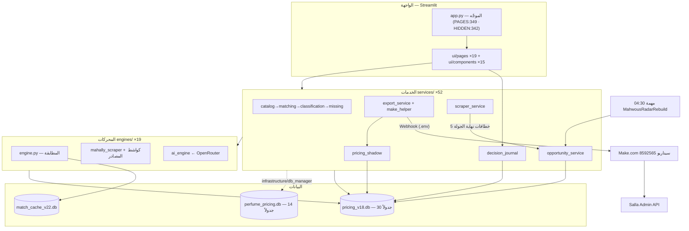

# «مهووس» — التوثيق المعماري الشامل وجرد المزايا

> توثيق بقراءة-فقط أُنجز في **2026-07-10** على فرع master (آخر وسم `green-1178-preprod`).
> كل ادّعاء مسنود بمسار + رقم سطر من الكود الحي وقت الفحص؛ ما لم يُتحقق منه مكتوب صراحةً «لم أتحقق».
> النسخة التفاعلية (Artifact): <https://claude.ai/code/artifact/1235b78c-1af2-4daf-847d-9ff892834942>

**لوحة الأرقام:** 1202 اختباراً أخضر (تشغيل حي) · 17 صفحة مسجّلة (14 ظاهرة) · 166 ملف Python غير اختباري + 107 اختبارات · 3 قواعد بيانات على القرص · 45 جدول مستخدم (30+14+1) · 280٬292 صف منتجات منافسين.

---

## 1) الحالة الصحية وبوابة الاختبارات

**بوابة الاختبارات خضراء بالكامل.** الأمر الإلزامي من CLAUDE.md شُغّل فعلياً وقت التوثيق والناتج الحرفي:
`1202 passed in 84.25s (0:01:24)` — أي **1202 اختباراً ناجحاً وصفر فشل**، أعلى من آخر وسم أخضر (`green-1178-preprod`) بـ24 اختباراً.

| البند | الحالة | الدليل الحرفي |
|---|---|---|
| الأمر المُشغَّل | ✅ نجح | `.venv/Scripts/python.exe -m pytest -q --ignore=tests/test_api.py` ⇒ `1202 passed in 84.25s` |
| حزمة `fastapi` | ⚠️ غائبة | `ModuleNotFoundError: No module named 'fastapi'` — لذلك يُستبعد `tests/test_api.py` (فجوة بيئة لا خطأ كود) |
| حزمة `ruff` | ⚠️ غائبة | `No module named ruff` — البديل: `python -m py_compile` |
| مهمة `MahwousRadarRebuild` | ✅ Ready · 04:30 | ناتج `schtasks /query` — تحديث الرادار بعد كشط الليل |
| مهمة `MahwousServer` | ✅ Running | ناتج `schtasks /query` |
| الفرع | ✅ master | `git branch --show-current` ⇒ `master` |
| نظافة الشجرة | ⚠️ 12 ملف حطام | 12 ملفاً غير مُتتبَّع 0-بايت في الجذر (القسم 10) — لم تُلمس |

### أرقام حيّة من القاعدتين (قراءة `mode=ro` فقط)

| المقياس | القيمة | المعنى |
|---|---|---|
| منتجات المنافسين | **280٬292** | `competitor_products_store` — حجم سوق المراقبة |
| كتالوجنا المرجعي | **11٬565** | `our_catalog` — مرجع «لديك/ليس لديك» |
| رادار الفرص (كاش) | **32٬972** | فتح فوري بدل ~39 ثانية |
| سجل قرارات المالك | **165** (125 send_price + 40 ignore) | جدول `events` — الدفتر حيّ ويتراكم إلحاقياً |
| سجل الإرسال إلى Make | **1٬138** | `send_log` |
| الظل السعري (م2) | **111** | بوابة م3 تشترط ~200 — **لم تُبلغ بعد** |
| وسم «⭐ الأقوى» (كاش) | **50٬469** | `product_top_competitor` |
| تقييم المتاجر (كاش) | **30** | `competitor_stores` |
| قرارات الرادار | **3** | `price_history` عبر `append_price_decision` حصراً |
| الإشعارات | **16** | `notifications` في perfume_pricing.db |

---

## 2) تعارضات الوثائق مع الكود الحي — بنود مستقلة

القاعدة: حين تتعارض وثيقة مع الكود، **الكود الحي يفوز**.

| # | الوثيقة تقول | الواقع الحي | الدليل |
|---|---|---|---|
| 1 | CLAUDE.md: الأساس **1046** | **1202** passed | ناتج pytest الحرفي (2026-07-10) |
| 2 | CLAUDE.md: **~27s** | **84.25s** (~3×) | `1202 passed in 84.25s` |
| 3 | المهارة: «~135 ملف .py» | **166** + 107 اختبارات | عدّ فعلي (استثناء .venv وtests) |
| 4 | المهارة: «24 جدول مستخدم» | **30** في pricing_v18 | استعلام `sqlite_master` ro — أُضيف: `pricing_guard_shadow, send_log, product_top_competitor, discovered_stores, competitor_heat, comp_catalog…` |
| 5 | CLAUDE.md ق6: «قاعدتا بيانات» | **ثلاث** على القرص + **رابعة** كسولة | `data/match_cache_v22.db` (كاتبها `engines/engine.py`) + `engines/price_monitor.py:63`: `def __init__(self, db_path: str = "data/price_monitor.db")` والملف غير موجود (يُنشأ عند أول استخدام لمسار لم يعمل بعد) |
| 6 | المهارة تحيل إلى `references/` | المجلد **غائب** محلياً | مسح فعلي — المهارة نفسها توثّق البديل |
| 7 | `core/enums.py:22` يستشهد بـ`_split_results (app.py:392)` | `app.py` موجّه من 448 سطراً؛ المنطق في `services/classification_service.py` | docstring الخدمة: «نقل _split_results» — استشهاد داخلي قديم |
| 8 | النسخة المحمولة تفترض قاعدتين | `scripts/make_portable_zip.py:30`: `DB_FILES = {"pricing_v18.db", "perfume_pricing.db"}` بلا match_cache | **[مُلحق 2026-07-10: حُسم — الاستثناء مقصود]** السطران 27-28 من الملف نفسه: `# كاشات قابلة لإعادة التوليد (تُستثنى لتخفيف الحجم).` و`SKIP_NAMES = {…, "match_cache_v22.db", …}` |

---

## 3) الرسم المعماري وتدفّق البيانات

**للمالك ببساطة:** التطبيق طبقات — الشاشات في الأعلى، تحتها «الخدمات» (منطق العمل)، تحتها «المحركات» (المطابقة والكشط والذكاء)، وكلها فوق قواعد البيانات. وعند «إرسال» تخرج الحمولة عبر Webhook إلى Make ثم متجرك في سلة.

### 🌙 المسار الليلي وخطافات نهاية الجولة
- **قبل الجولة:** ترتيب المنافسين بالحرارة — الأسخن أولاً (`services/scraper_service.py:462-466`).
- **نهاية الجولة** (`scrape_all` حيث لا أحد ينتظر) — خمسة خطافات متتالية كلٌّ مطوَّق بـtry/except: `opportunity_scores` ⇒ `product_top_competitor` ⇒ `competitor_stores` ⇒ `discovered_stores` ⇒ `competitor_heat` (`scraper_service.py:476-529`).
- **04:30:** مهمة `MahwousRadarRebuild` تنفّذ `scripts/rebuild_radar.py`.
- **عند كل إرسال:** الظل يدوّن في `pricing_guard_shadow` من نقطتي الاختناق (`utils/make_helper.py:92` + `services/export_service.py:362`)، والدفتر يدوّن فعل المستخدم في `events`.

---

## 4) جرد الصفحات الـ17 (PAGES — app.py:349-367)

`HIDDEN_PAGES` (app.py:342-346) والتعليق الحرفي فوقها (app.py:341): *«إخفاء من القائمة فقط — لإعادة أي صفحة احذف اسمها من هنا (لا يحذف الصفحة ولا استيرادها)»* — **إخفاء متعمّد قابل للعكس، لا حذف**.

| الصفحة | الملف | وظيفتها الفعلية | الحالة |
|---|---|---|---|
| 📊 لوحة التحكم | `ui/pages/dashboard.py` | رفع + تحليل + مؤشرات + تنبيه النفاد + ملخّص السوق 24h | ظاهرة |
| 🆕 جديد عند المنافسين | `ui/pages/new_at_competitors.py` | جديد (+ 🔴 نفذت) موحّد + «الأحدث رصداً» 🆕 | ظاهرة |
| 🔴 سعر أعلى | `ui/pages/price_raise.py` | غلاف على العارض المشترك `_section_page.py` | ظاهرة |
| 🟢 سعر أقل | `ui/pages/price_lower.py` | غلاف رفيع | ظاهرة |
| ✅ موافق عليها | `ui/pages/approved.py` | غلاف رفيع | ظاهرة |
| 🔍 منتجات مفقودة | `ui/pages/missing.py` | «مركز عمليات المفقودات» — الطوابير + مطابق الملكية بطبقتيه + المراجعة + تصدير الشامل | ظاهرة |
| ⚠️ تحت المراجعة | `ui/pages/review.py` | ثقة متوسطة (65–82) + شريط إجراءات | ظاهرة |
| ⚪ مستبعد | `ui/pages/excluded.py` | بلا تطابق + 🧠 إحياء بالذكاء | ظاهرة |
| 🔄 إعادة التوزيع | `ui/pages/redistribute.py` | إعادة توزيع العالقة بالذكاء (Dry-Run) + بوابة النص البديل ❌ | ظاهرة |
| ✅ تمت المعالجة | `ui/pages/processed.py` | أرشيف + تراجع + ملخص AI | ظاهرة |
| 🕷️ كشط المنافسين | `ui/pages/scraper.py` | إدارة + كشط + اكتشاف متاجر جديدة | ظاهرة |
| 🎯 رادار الفرص | `ui/pages/opportunity_radar.py` | عرض فقط؛ القرارات تكتب `price_history` عبر `append_price_decision` (`:162,179`) | ظاهرة |
| ⚡ أتمتة Make | `ui/pages/make_automation.py` | Webhooks وسجل الإرسال | **مخفية عمداً** |
| 🔄 الأتمتة الذكية | `ui/pages/smart_automation.py` | صفحة الأتمتة الذكية | **مخفية عمداً** |
| ✨ مصنع المنتجات | `ui/pages/product_factory.py` | إنشاء منتجات وإرسالها | **مخفية عمداً** |
| 🗑️ سلة المحذوفات | `ui/pages/trash_bin.py` | مسار التراجع الوحيد؛ الاسترداد = قرار `recover` | ظاهرة بقرار المالك |
| ⚙️ الإعدادات | `ui/pages/settings.py` | الواجهة الوحيدة الكاتبة لـ`.env` | ظاهرة بقرار المالك |

---

## 5) أقسام التسعير الستة وطبقات المفقودات

الأقسام الستة الحصرية — `core/enums.py:18-30` (موسوم `#PRESERVED_LOGIC`):
🔴 `PRICE_RAISE` سعرنا أعلى · 🟢 `PRICE_LOWER` سعرنا أقل · ✅ `APPROVED` مناسب · 🔍 `MISSING` ليس عندنا · ⚠️ `REVIEW` ثقة متوسطة · ⚪ `EXCLUDED` لا تطابق.

**عتبات الثقة** (`core/enums.py:52-54`): ≥82 ⇒ CONFIRMED «نملكه» (إخفاء آمن) · 65–82 ⇒ REVIEW «محتمل موجود» · أقل ⇒ لا تطابق. **حارس الجنس** (`:133-140`): جنسان صريحان مختلفان ⇒ لا إخفاء أبداً، مراجعة.

**طبقات المفقودات:**
- فلتر النوع: غير العطور تُسقط (`enums.py:89-122` `droppable_from_missing`).
- الطبقة الصارمة: `services/ownership_matcher.py` «نملكه باسم آخر» (306 دقيقة بدل 1٬334 وهمية) + لوحة مراجعة قابلة للتراجع.
- طبقة «محتمل»: تحت الصارمة، تُعرض دون إخفاء تلقائي (جلسة 16).
- ترتيبات: «الأهم أولاً» و«الأحدث رصداً» 🆕 و«الأكثر طلباً (تقييماً)».
- الحاجز القديم `smart_missing_barrier` (`engines/engine.py:3798`): قيس ضاراً 91% خطأ — **يبقى غير موصول عمداً** (قسم 10).

---

## 6) جرد الخدمات — services/ (52 ملفاً)

### أ · خط التحليل والتسعير الحي
| الخدمة | مهمتها | من يستدعيها |
|---|---|---|
| `catalog_service` | تحميل كتالوجنا وتوحيد أعمدته | app، bootstrap |
| `matching_service` | المطابقة الضبابية (نقل حرفي) | bootstrap، missing، ownership… |
| `classification_service` | التوزيع على الأقسام الستة (نقل _split_results) | bootstrap، audit |
| `missing_service` | كشف المفقودات | bootstrap |
| `audit_service` | مدقّق حفظ البيانات | bootstrap |
| `reclassify_missing` | اقتراح إعادة تصنيف (نقي) | missing_service + سكربتا التوزيع |
| `ownership_matcher` | «نملكه باسم آخر» بطبقتيه | صفحة المفقودات |
| `ownership_service` | الملكية الموحّدة (جديد/نفذت ↔ كتالوجنا) | صفحة الجديد |
| `export_service` | تصدير Make/Salla/CSV/Excel | bootstrap + 4 واجهات |
| `decision_journal` | دفتر القرارات (كتابة فقط في events) | action_bar، price_action، missing، trash_bin |
| `pricing_shadow` | السياج الظلّي — تدوين فقط | export_service + make_helper |
| `opportunity_service` | الرادار + بناء الكاش | scraper_service، الرادار، rebuild_radar |

### ب · الكشط وذكاء المتاجر
| الخدمة | مهمتها |
|---|---|
| `scraper_service` | إدارة المنافسين + الكشط + الخطافات الخمسة |
| `volatility_service` | حرارة المنافسين (جدولة تتنفّس) |
| `top_competitor_service` | الملف التقييمي + وسم «⭐ الأقوى» (كاش) |
| `store_profile_service` | تقييم المتجر 🏪 (كاش) |
| `store_discovery_service` | اكتشاف متاجر جديدة (كاش) |
| `alert_service` | «نفد عند المنافس ومتوفر عندك» (لوحة التحكم) |

### ج · الذكاء الاصطناعي
`ai_service` (OpenRouter عبر .env، تدوير/دفعات/كاش) · `ai_router_service` (Zero-Loss Router) · `ai_prompts` · `ai_redistributor` (Dry-Run) · `missing_orchestrator` (خط التجميع) · `category_classifier` · `enrichment_service` (القاعدة الذهبية) · `brand_manager` (ماركات سلة).

### د · منظومة v2 عبر الحاوية (perfume_pricing.db)
تُبنى كلها في `bootstrap.py` وتكتب عبر `infrastructure/db_manager.py`. أبرز المستهلكين الأحياء: الإشعارات في الشريط الجانبي (`app.py:390-399`) وجودة البيانات في لوحة التحكم.
`workflow/` (notification_engine، approval_workflow، autopilot، rollback_manager، smart_batcher) · `learning/` (feedback_collector، confidence_calibrator، pattern_memory) · `intelligence/` (competitor_modeler، price_predictor، seasonal_engine) · `monitoring/` (anomaly_detector، data_quality، price_monitor) · `swarm/` (orchestrator، agents) · `background/scheduler`.

---

## 7) الكواش المشتقة — متى تُبنى ومن يقرؤها

عقيدة البيانات: الكواش وحدها يجوز فيها DELETE+INSERT معاملي؛ الأرشيفات إلحاقية للأبد.

| الكاش | يبنيه | متى | من يقرؤه | صفوف |
|---|---|---|---|---|
| `opportunity_scores` | `opportunity_service.rebuild_opportunity_scores` | نهاية الجولة (`scraper_service.py:479-481`) + كشط مفرد (`:264-272`) + مهمة 04:30 | الرادار + `pricing_shadow` | 32٬972 |
| `product_top_competitor` | `top_competitor_service.rebuild_top_competitor` (`_TABLE:27`) | نهاية الجولة (`:490-492`) | `_section_page:169`، الجديد `:383`، المفقودات `:194,212` | 50٬469 |
| `competitor_stores` | `store_profile_service.refresh_store_profiles` (`_TABLE:21`) | نهاية الجولة (`:501-503`) | شارة 🏪 في 3 صفحات | 30 |
| `discovered_stores` | `store_discovery_service.refresh_discovered_stores` (`:115-118`) | نهاية الجولة (`:512-516`) + زر (`scraper.py:182`) | صفحة الكشط (`:185`) | 0 (حالة بيانات) |
| `competitor_heat` | `volatility_service.rebuild_competitor_heat` | نهاية الجولة (`:525-526`) | ترتيب بداية الجولة (`:463-464`) | لم أعدّ |
| `cache` (match_cache_v22.db) | `engines/engine.py` (`_cset:449`) | أثناء المطابقة بالذكاء | المحرك (`_cget:437`) + e2e | 4 |

---

## 8) الخطافات في دورة الكشط والتسعير

| الخطاف | أين | ماذا يفعل | سلوك الفشل |
|---|---|---|---|
| ترتيب الحرارة | `scraper_service.py:462-466` قبل الجولة | الأسخن أولاً | fail-open |
| كاش الفرص بعد كشط مفرد | `:264-272` | rebuild opportunity | «فشله لا يُفشل الكشط» |
| خطافات نهاية الجولة ×5 | `:476-529` | فرص⇒أقوى⇒متاجر⇒اكتشاف⇒حرارة | كلٌّ مطوَّق تحذيراً |
| الظل عند الإرسال | `make_helper.py:92` + `export_service.py:362` | `record_shadow` (ok/below/above/stale/no_row) | «لا يمنع الإرسال أبداً» (`pricing_shadow.py:75-79`) |
| دفتر القرارات | 4 مواضع UI | `record_decision`⇒`log_event`⇒INSERT في `events` (`decision_journal.py:34-38` + `db_manager.py:476`) | «لا يرفع استثناءً أبداً» |
| بيئة التطوير | `.claude/hooks/check_syntax.py` + pre-commit | فحص نحوي + بوابة pytest | commit يُرفض |
| الجدولة | `MahwousServer` + `MahwousRadarRebuild` 04:30 ⇒ `scripts/rebuild_radar.py` | الخادم + طزاجة الرادار | — |

---

## 9) جرد الجداول الـ45 — الكاتب والقارئ الحي

**المنهج:** مسح regex لأنماط SQL (متعدد الأسطر) + تتبّع يدوي للملتبس. «له كاتب» ≠ «له قارئ حي»؛ القارئ الاختباري يوسم (T).

### pricing_v18.db — 30 جدولاً
| الجدول | الكاتب | القارئ | الحالة |
|---|---|---|---|
| `competitor_products_store` | mahally_scraper، scraper_service، db_manager | 14 وحدة حية | ✅ قلب النظام — 280٬292 |
| `our_catalog` | db_manager (`upsert_our_catalog`) | alert، opportunity، send_log | ✅ 11٬565 |
| `events` | `log_event:472-480` (يستدعيه الدفتر) | `get_events:839` | ✅ إلحاقي — 165 |
| `price_history` | `append_price_decision:585` (قرارات) + `upsert_price_history:523` (سوق، عبر `:2654`) | الرادار + db_manager | ✅ مساران منفصلان عمداً (docstring `:591`) |
| `opportunity_scores` | opportunity_service | الرادار، الظل، rebuild_radar | ✅ كاش — 32٬972 |
| `product_top_competitor` | top_competitor_service | 3 صفحات | ✅ كاش — 50٬469 |
| `competitor_stores` | store_profile_service | 3 صفحات | ✅ كاش — 30 |
| `discovered_stores` | store_discovery_service | صفحة الكشط | كاش — 0 حالياً |
| `competitor_heat` | volatility_service | ترتيب الجولة | ✅ كاش |
| `pricing_guard_shadow` | pricing_shadow (INSERT صرف) | الاختبارات فقط (T) | ⚠️ مقصود مرحلياً — قارئه الحي هدف م3 (111/200) |
| `send_log` | utils/send_log | send_log (حارس SKU) + صفحة الأتمتة | ✅ 1٬138 |
| `scrape_runs` | mahally + scraper_service | scraper + store_profile | ✅ |
| `product_signal_events` | mahally_scraper | alert + volatility | ✅ وقود التنبيهات والحرارة |
| `competitor_intake_ledger` | ledger + db_manager | ledger | ✅ قياس |
| `comp_catalog`·`competitors`·`competitor_aliases`·`force_links`·`product_overrides`·`hidden_products`·`processed_products`·`job_progress`·`analysis_history`·`product_state`·`db_version`·`automation_settings` | داخل db_manager عبر دوال مسمّاة | الطبقات الأعلى | حي عبر db_manager — لم أتتبّع كل مستدعٍ فردياً |
| `decisions` | `log_decision:484-497` **بلا أي مستدعٍ** | `get_decisions:500` بلا مستدعٍ | 🔴 **0 صفوف** — سجل القرارات الفعلي هو `events` |
| `automation_log` | لا كاتب — `CREATE TABLE` فقط (`:1686`) | لا قارئ | 🔴 **0 صفوف** — مخطّط بلا كاتب |
| `product_transitions` | INSERT (`:371,422`) داخل دوال بلا مستدعٍ خارجي | `get_transitions:432` بلا مستدعٍ | 🔴 **0 صفوف** |
| `ai_cache` | db_manager | لا قارئ مرصود بالمسح | ⚠️ لم أتحقق أعمق |

### perfume_pricing.db — 14 جدولاً
| الجدول | الكاتب | القارئ | ملاحظة |
|---|---|---|---|
| `notifications` | notification_engine | الشريط الجانبي (`app.py:390-399`) | ✅ 16 — الإخفاء بوسم مقروء لا DELETE |
| `ai_decisions_log` | ai_decisions_repo | صفحة إعادة التوزيع + ai_redistributor + copilot | ✅ |
| `ai_call_metrics` | ai_metrics | نفسه + (T) | قياس |
| `feedback_records` | feedback_collector | 3 وحدات تعلم | حلقة التعلم |
| `price_alerts`·`price_snapshots` | monitoring/price_monitor | نفسه | مراقبة v2 |
| `price_anomalies` | anomaly_detector | نفسه | مراقبة |
| `competitor_profiles` | competitor_modeler | نفسه | نمذجة |
| `approval_requests`·`autopilot_log`·`rollback_snapshots` | وحدات workflow | أنفسها | سير عمل v2 |
| `user_patterns` | pattern_memory | نفسه | تعلم |
| `product_entities`·`product_events` | product_repository + الهجرة 001 (استيراد ديناميكي `product_repository.py:24`) | الريبو + `api/main.py` | قارئ api يحتاج fastapi الغائبة |

### match_cache_v22.db — جدول واحد
`cache(h TEXT PRIMARY KEY, v TEXT, ts TEXT)` — كاش مطابقة الذكاء (`engines/engine.py:391-461` + `ai_engine.py:1300-1304` ببادئة `dedup:`).

---

## 10) كشف ما لا يعمل والكود الميت — بالفئات الست (توثيق للمراجعة فقط)

> **لا يُقترح هنا حذف أي شيء — القرار للمالك حصراً.**

### [صفحة مخفية عمداً في HIDDEN_PAGES] — 3
«⚡ أتمتة Make» و«🔄 الأتمتة الذكية» و«✨ مصنع المنتجات» — `app.py:342-346` + التعليق `:341`. ملفاتها موجودة ومستوردة (`app.py:27,34,39`) ومسجّلة في PAGES — **قابل للعكس بسطر واحد**.

### [وحدة تجريبية غير موصولة] — 6
| الوحدة | الدليل | السياق |
|---|---|---|
| `services/pricing_service.py` | مستورَد فقط في `tests/test_pricing_service.py:5` و`tests/test_integration.py:13` | قاعدة CLAUDE.md 11: لا يُوصَل قبل مواءمة v1 وموافقة المالك |
| `core/pricing_guard.py` | `def apply_policy_v1(` سطر 31؛ المستورد الوحيد `tests/test_pricing_guard.py:8` | v1 النقية بانتظار م3 (بوابة ~200 صف ظل؛ الآن 111) |
| `services/copilot_service.py` | صفر مستوردين إنتاجياً؛ يختبره `test_copilot_service.py` | جاهز غير موصول |
| `ui/components/expert_card.py` | صفر مستوردين؛ يختبره `test_expert_card.py` | «تيرمنال العطور» لم يُدمج |
| `engines/async_scraper.py` وسلسلته (selenium_scraper_v30، json_ld_extractor، robots_cache) | صفر مستوردين إنتاجياً | مسار الكشط القديم؛ الحي عبر scraper_service |
| `api/` (main.py، deps.py) | fastapi غائبة | فجوة بيئة لا عطب |

### [UI معطوب — دالّة معرَّفة بلا استدعاء حيّ] — 1
`ui/pages/settings.py:153`: `def _render_thresholds() -> dict[str, Any]:` — **التطابق الوحيد في المستودع**. قسم «عتبات التسعير» لا يُعرض ولا يُحفظ. معروف ومؤجَّل بقرار سابق.

### [جدول له كاتب بلا قارئ حيّ] — 4 (+1 مقصود مرحلياً)
- `decisions` — 0 صفوف؛ `log_decision:484` و`get_decisions:500` بلا مستدعين.
- `automation_log` — CREATE فقط (`:1686`)؛ 0 صفوف — «مخطّط بلا كاتب».
- `product_transitions` — كاتبان (`:371,422`) داخل دوال بلا مستدعٍ؛ 0 صفوف.
- `ai_cache` — كاتب بلا قارئ مرصود (تحفّظ: لم أتتبّع أعمق).
- `pricing_guard_shadow` — كاتب حي (111)؛ قارئه الحي مُصمَّم لم3 — **تصميم مرحلي لا عطب**.

### [ملف حطام 0-بايت في الجذر] — 12
`(send_log`، `(ث)`، `0`، `5}`، `92`، `92)`، `Optional[int]`، `bool`، `list[PossibleMatch]`، `pd.DataFrame`، `~30`، `أو` — أسماء شظايا كود (كتابة وكيل موازٍ خاطئة). العقيدة: **جرد لا حذف أعمى** — أُحصيت ولم تُلمس.

### [كود ميت حقيقي قابل للحذف] — 5 (القرار للمالك)
| البند | الدليل الحرفي | ملاحظة |
|---|---|---|
| `engines/engine.py:3798` `smart_missing_barrier` | `def smart_missing_barrier(missing_df: pd.DataFrame, our_df: pd.DataFrame, threshold: int = 92) -> pd.DataFrame:` — صفر مستدعين حتى في الاختبارات (الذكر الآخر الوحيد: docstring تاريخي `ownership_matcher.py:5`) | قيس ضاراً 91%؛ قرار موثّق أن يبقى غير موصول؛ بديله الحي ownership_matcher |
| `ui/components/product_timeline.py` | صفر مستوردين؛ الاسم المشابه في `tests/test_api.py:106` اختبار مسار API لا استيراد | لم يُدمج |
| `utils/data_sanitizer.py` | صفر مستوردين وصفر ذكر اختبارياً | طبقة قديمة |
| `utils/sitemap_cache.py` | صفر مستوردين وصفر ذكر | — |
| `engines/async_scraper.py:945` استيراد `engines.sitemap_resolve` | `from engines.sitemap_resolve import (` والوحدة **غير موجودة في الشجرة**؛ مطوَّق (`:950` `logger.error("تعذّر تحميل engines.sitemap_resolve")`) | أثر حادثة فقدان الملفات (2026-06-28) |

### 🛡️ دروع الإيجابيات الكاذبة — يبدو مشبوهاً وهو سليم
| الاشتباه | الحقيقة بالدليل |
|---|---|
| «نسختا normalize مكررتان» | سلوكان مقصودان: الخفيف `_normalize_for_store` مقابل الثقيل — `pricing_shadow.py:11-12`: الثقيل على مفاتيح الكاش «يُفشل كل بحث» |
| «مديرا قاعدة مكرران» | `utils/db_manager` = pricing_v18؛ `infrastructure/db_manager` = perfume_pricing (`conf/settings.py:101`) |
| «مراقبا أسعار مكرران» | `engines/price_monitor` (price_monitor.db كسولة؛ مسار الموحّد `scraper_service.py:298`) ≠ `services/monitoring/price_monitor` (perfume_pricing) |
| «مديرا ماركات مكرران» | `services/brand_manager` (متجرنا/سلة) ≠ `utils/brand_manager` (العالمية المفقودة) |
| «config.py ميت بجانب conf/» | حيّ: تستورده المحركات الأربعة — ازدواج موروث لا كود ميت |
| «upsert_price_history محظور ومستخدَم!» | الحظر على **القرارات**؛ الاستدعاء الحي (`db_manager.py:2654`) لتاريخ السوق داخل `save_realtime_results`؛ القرارات تسلك `append_price_decision` «عمداً منفصلة» (`:591`) |
| «webhook في الكود!» | `make_helper.py:36,40` = `YOUR_WEBHOOK_URL_HERE` placeholder؛ الحقيقية من .env (`config.py:114-115`) |
| «الهجرة 001 يتيمة» | مستوردة ديناميكياً (`product_repository.py:24` importlib) |
| «سكربتات الجذر يتيمة» | نقاط دخول تُشغَّل مباشرة (منها rebuild_radar عبر مهمة 04:30) |

---

## 11) فهرس الملفات الـ166 — موجز الطبقات

- **الجذر (7):** `app.py` (الموجّه)، `bootstrap.py` (الحاوية DI)، `config.py` (إعدادات موروثة للمحركات)، `e2e_health_check.py`، `fix_tool.py`، `_run_live_analysis.py`، `_run_review_full.py` — الأربعة الأخيرة نقاط دخول يدوية.
- **scripts (6):** `backup_data` (نسخ آمن VACUUM INTO)، `rebuild_radar` (مهمة 04:30)، `redistribution_apply/_dryrun`، `perf_baseline`، `make_portable_zip`.
- **core (6):** enums (17 مستورِداً)، models، exceptions، product_entity (12 لمنظومة v2)، pricing_guard (0 — بانتظار م3).
- **conf (3):** constants (**37 مستورِداً** — الأكثر في المشروع)، settings (مسار perfume_pricing).
- **infrastructure (6):** db_manager v2 (15)، product_repository، ai_decisions_repo، الهجرة 001 (ديناميكية).
- **observability (3):** ai_metrics، ledger (قياس Phase 0).
- **api (3):** FastAPI v4 — معلّق على فجوة fastapi.
- **engines (19):** engine (قلب المطابقة، 9 مستوردين)، mahally_scraper (6)، unified + salla/global/perfume، ai_engine (9)، closed_loop، competitor_intelligence، missing_products_engine، duplicate_detector، golden_template، price_monitor (مسار الموحّد)، prompts، mahwous_core + الخاملة: async_scraper، selenium_scraper_v30، json_ld_extractor.
- **services (52):** مفصّلة في القسم 6.
- **ui (38):** state_manager (**22 مستورِداً**)، reconcile، review_ai، 19 صفحة (منها العارض المشترك `_section_page`)، 15 مكوّناً (منها الخاملان expert_card وproduct_timeline).
- **utils (22):** db_manager (بيت SQL لـpricing_v18)، data_paths (19)، make_helper (بوابة Make + نقطة الظل)، send_log، salla_shamel_export (7)، product_gate، salla_api، missing_queue_manager، supabase_client، seo_meta، brand_logo، mahwous_links، product_key، data_helpers، helpers، brand_manager (العالمية)، gcp_db، competitor_product_scraper، robots_cache + الخاملان: data_sanitizer، sitemap_cache.

> الخريطة الكاملة (كل ملف: مهمته + من يستورده + ماذا يستورد) في النسخة التفاعلية (Artifact) أعلاه.

---

## 12) ما لم أتحقق منه بعد — مُعلَن بصدق

- مستدعو كل دالة من دوال db_manager للجداول العاملة غير المتنازع عليها — وُسمت «حي عبر db_manager» دون تتبّع فردي.
- قارئ محتمل لـ`ai_cache` بصيغة لم يلتقطها نمط المسح.
- حجم `data/ui_session.json` الحالي (آخر توثيق: 65MB).
- عدد صفوف `competitor_heat`.
- سلامة سيناريو Make 8592565 من جهة منصة Make — التوثيق من جهة الكود المُرسِل فقط.
- آلية `hidden_products` الجدولية مقابل آلية اللقطة — لم أعِد التحقق من مستدعي `save_hidden_product/get_hidden_product_keys` هذه الجلسة.

---

*أُعدّت بقراءة-فقط في 2026-07-10 (كُتب هذا الملف على القرص بموافقة المالك الصريحة في نفس اليوم). كل الأرقام والأسطر لقطة زمنية — عند الشك، الكود الحي هو الحَكَم.*
